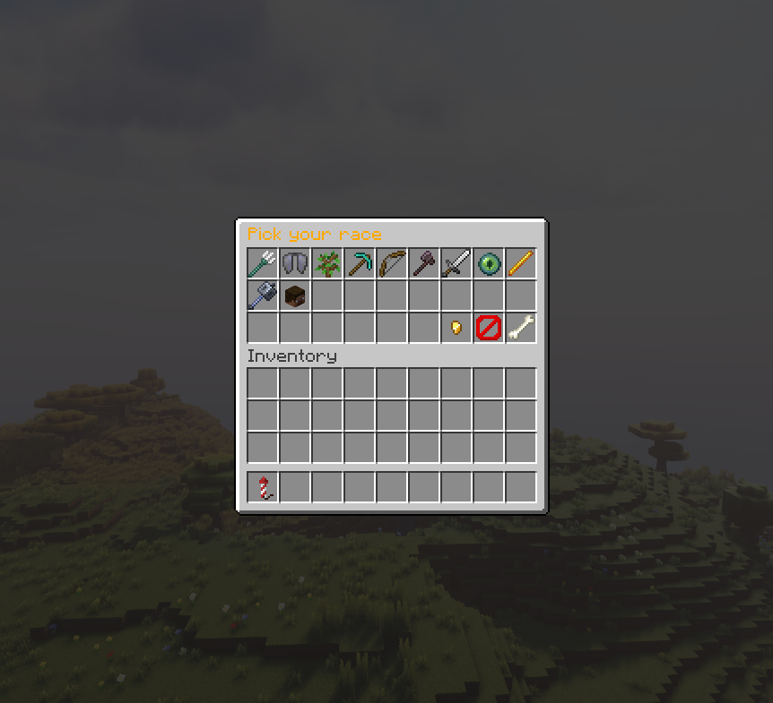

# Magik Plugin

Magik is a custom Minecraft plugin that introduces unique races, abilities, and items to enhance gameplay. Players can choose their race, use special items, and interact with the world in new and exciting ways.

## Features

- **Custom Races**: Choose races with unique abilities and mechanics, but beware the drawbacks!.
- **Special Items**: Includes items like the `Strange Rock` to change your race
- **Commands**: Manage races and items with intuitive commands.
- **Configurable**: Easily toggle each race on and off in the config file.

## Commands

| Command               | Description                                                                 |
|-----------------------|-----------------------------------------------------------------------------|
| `/magik set <player> <race>` | Assign a specific race to a player.                                    |
| `/magik check <player>`      | Check the race of a specific player.                                  |
| `/magik inv [player]`        | Open the race selection menu for yourself or another player.          |
| `/magik give <player> <item>`| Give a special item (e.g., `strange_rock`, `backpack`) to a player.   |

## Races

Each race comes with unique abilities and mechanics:
- **Aquarian**: Become an aquatic creature with special swimming abilities.
- **Avian**: Fly through the skies with enhanced agility, but don't get hit!
- **Blazeborn**: Fight fire with fire, and embrace lava as your ally.
- **Druid**: Live in harmony with nature, using the environment to your advantage.
- **Dwarf**: The mines are calling you, will you answer?
- **Elf**: Sneak around and shoot arrows with deadly precision.
- **Enderian**: Teleport, but you can never fly
- **Giant**: Crush your enemies beneath your feet, but it is very hard to hide.
- **Goblin**: While goblins may be weaker, they make up for it with their speed.
- **Human**: Play as minecraft was intended
- **Orc**: The brute force of the orc is unmatched, but they are not very quick.
- **Lycan**: Coming Soon
- **Leprechaun**: Coming soon
- **Pixie**: Coming Soon
- **#######**: Coming soon

## Selection Menu

Upon joining, players will be given a menu to select the race they would like to play as. A special item can be crafted later to change races, the recipe for which is shown in the ingame recipe book.

*Race selection menu for players.*

## Installation

1. Download the plugin `.jar` file.
2. Place it in your server's `plugins` folder.
3. Restart your server.
4. Configure the plugin as needed.

## Requirements

- Minecraft Server (Spigot or Paper)
- Java 8 or higher

## Contributing

Feel free to fork the repository and submit pull requests. Contributions are welcome!

## License

This project is licensed under the [MIT License](./LICENSE).
